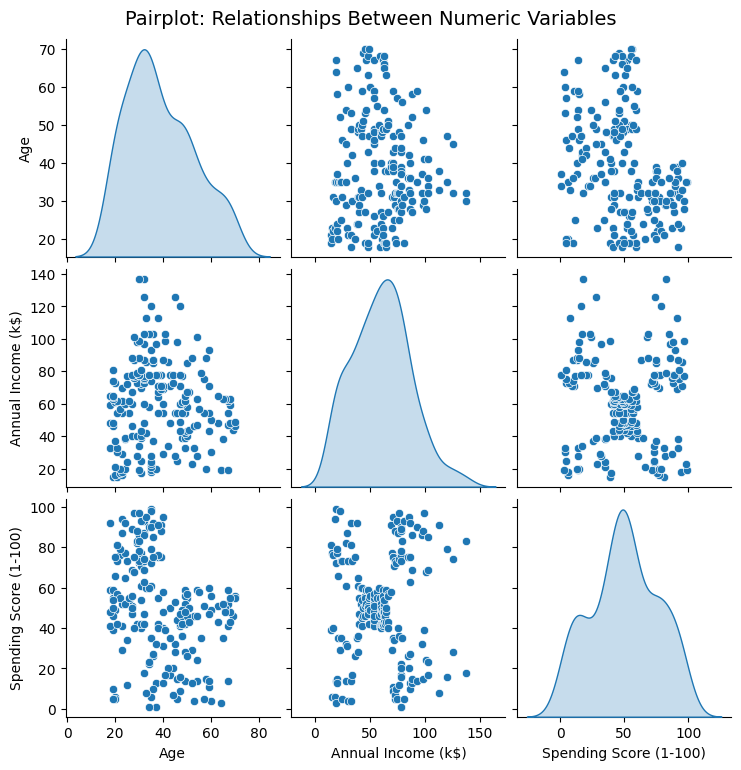
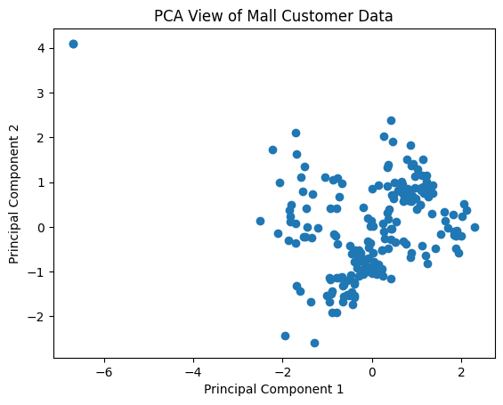

# 🛍️ Mall Customer Segmentation using K-Means Clustering
📘 Overview

This project focuses on segmenting mall customers into distinct groups using the K-Means clustering algorithm.
The goal is to identify patterns in customer demographics and spending behavior to help businesses understand and target specific customer segments more effectively.

📂 Dataset

Dataset[https://www.kaggle.com/datasets/vjchoudhary7/customer-segmentation-tutorial-in-python]
Source: Kaggle – Mall Customer Segmentation Data

## 🖼️ Model Output

Here’s the **Best K value** visualization:

Here’s the **Elbow Method** used to find the optimal number of clusters:

Here’s how the **K-Means Clustering** looks:

Here’s the **Pairplot** visualization:

And here’s the **PCA (Principal Component Analysis)** result:

## Features:

- CustomerID – Unique identifier for each customer (dropped before clustering)

- Gender – Male/Female (encoded as 1/0)

- Age – Customer’s age

- Annual Income (k$) – Customer’s annual income in thousands

- Spending Score (1–100) – Mall-assigned score based on spending patterns

## 🧭 Project Workflow
### 1️. Data Loading & Exploration

The dataset was loaded and explored for missing values, duplicates, and data types.
Basic descriptive statistics were examined, and relationships between numeric features were visualized using histograms and pairplots to understand data distribution and correlations.

### 2️. Data Preprocessing

- Gender Encoding: Converted gender values to numeric (Male = 1, Female = 0).

- Dropped Irrelevant Columns: Removed CustomerID as it has no analytical significance.

- Created Age Groups: Categorized customers into four age groups — below 25, 26–40, 41–60, and above 60.

- New Feature: Derived a feature called Income_to_Spending to represent the relationship between income and spending behavior.

- Selected Features: Used Age Group, Annual Income, Spending Score, and Income-to-Spending ratio for clustering.

### 3️. Feature Scaling

Standardized the selected features using StandardScaler to normalize the data.
Scaling ensures all features contribute equally to distance-based clustering.

### 4️. Dimensionality Reduction

Applied Principal Component Analysis (PCA) to reduce data to two principal components for visualization purposes.
This helps to view how customers are distributed and grouped in lower dimensions.

### 5️. K-Means Clustering

Performed K-Means clustering with different values of K (number of clusters).
The Elbow Method was used to identify the optimal K value by analyzing Within-Cluster Sum of Squares (WCSS).
Clusters were then assigned to each customer for segmentation.

### 6️. Cluster Visualization

Visualized the resulting clusters in 2D using PCA-reduced components.
Each cluster was color-coded to clearly differentiate between customer segments.
The visualization showed distinct groups based on spending habits and income levels.

### 7️. Model Evaluation

Evaluated clustering quality using the Silhouette Score, which measures how similar each data point is to its assigned cluster versus others.
The silhouette score helped determine how well-separated and dense the clusters were.
### A score obtained: 0.439, indicating moderate separation.
